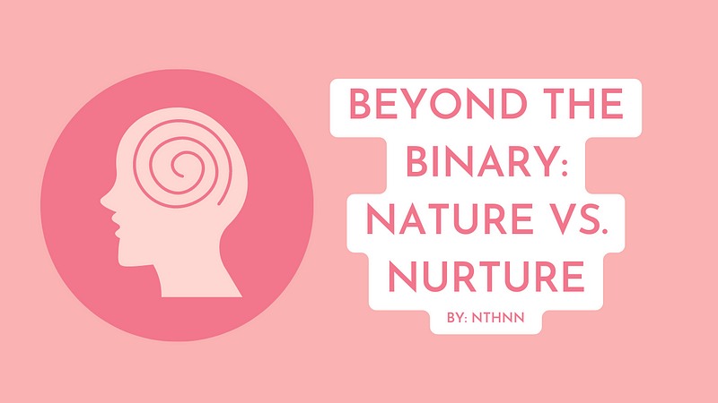

# Medium Blogs

Hello, I'm nthnn! I'm a full-stack developer, software engineer, mobile app developer, web developer, and an avid explorer of embedded systems with a deep passion for learning and sharing knowledge. I love to explore new ideas and concepts in various fields and use my skills to create innovative solutions to complex problems. As a data scientist, I have a keen eye for detail and a talent for extracting meaningful insights from complex datasets. In my free time, you can find me playing my guitar, writing my articles here, or exploring new technologies.

I believe that learning should be a lifelong pursuit, and I'm always on the lookout for new opportunities to grow and expand my horizons. Thank you for visiting my account, and I hope you find something here that inspires you to learn and create something amazing!

## My Articles

[Beyond the Binary: Rethinking the Nature vs. Nurture Debate](article-1.md)

There is ongoing debate in psychology and philosophy about the extent to which nature (i.e., genetics, biology) or nurture (i.e., environment,...

  

[Using context-free grammars (CFGs) to model and analyze DNA genetic sequences](article-2.md)

First and foremost, I am not an expert in the field of biology. Errors and/or mistakes might be up ahead. However, it is my gratitude to...