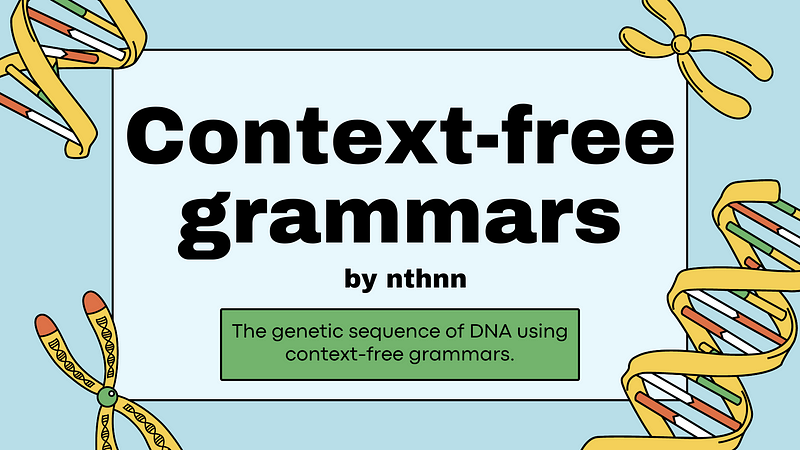
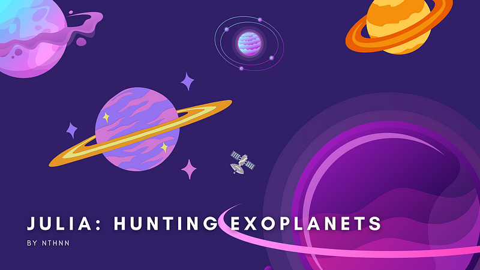

# Medium Blogs

Hello, I'm nthnn! I'm a full-stack developer, software engineer, mobile app developer, web developer, and an avid explorer of embedded systems with a deep passion for learning and sharing knowledge. I love to explore new ideas and concepts in various fields and use my skills to create innovative solutions to complex problems. As a data scientist, I have a keen eye for detail and a talent for extracting meaningful insights from complex datasets. In my free time, you can find me playing my guitar, writing my articles here, or exploring new technologies.

I believe that learning should be a lifelong pursuit, and I'm always on the lookout for new opportunities to grow and expand my horizons. Thank you for visiting my account, and I hope you find something here that inspires you to learn and create something amazing!

## My Articles

[Beyond the Binary: Rethinking the Nature vs. Nurture Debate](article-1.md)

There is ongoing debate in psychology and philosophy about the extent to which nature (i.e., _genetics_, _biology_) or nurture (i.e., _environment_, _experience_) shapes human behavior. While there is no...

---

[Using context-free grammars (CFGs) to model and analyze DNA genetic sequences](article-2.md)

The genetic sequence of DNA can be represented using a context-free grammar (CFG) which can be deterministic or non-deterministic. While the CFG is a formal...

---

[Discovering New Worlds with Julia-lang: Introduction to How Exoplanets are Found and Studied](article-3.md)

Exoplanets, or planets that orbit stars outside of our solar system, have been a subject of fascination for astronomers for many years. The first exoplanet was...

