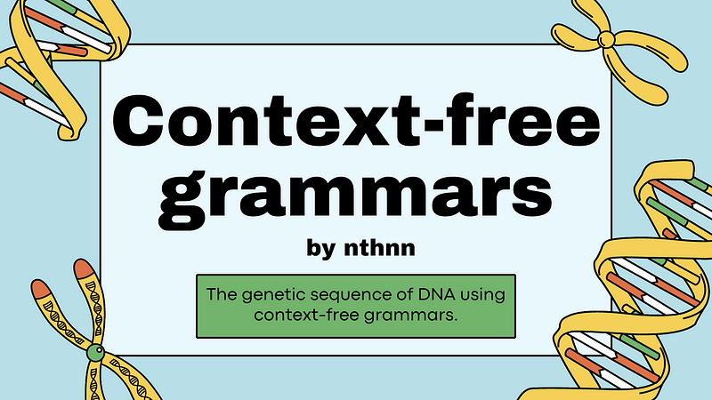
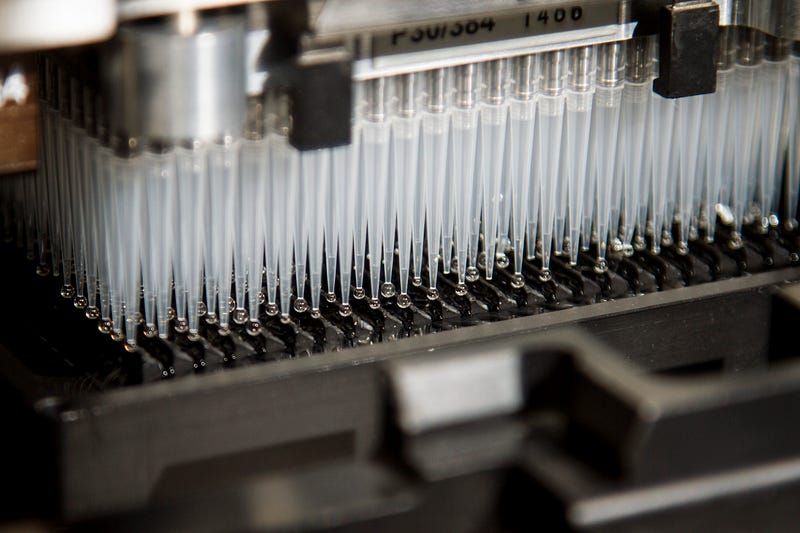
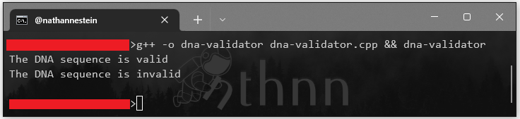

### Using context-free grammars (CFGs) to model and analyze DNA genetic sequences

First and foremost, I am not an expert in the field of biology. Errors and/or mistakes might be up ahead. However, it is my gratitude to share my personal project’s insights. And I believe that the context-free grammars themselves provides a powerful tool for analyzing and understanding the structure and function of genetic sequences. By formalizing the structural patterns of DNA sequences, context-free grammars can be used to generate, analyze, and classify them in a systematic and automated manner.

The genetic sequence of DNA can be represented using a context-free grammar (CFG) which can be deterministic or non-deterministic. While the CFG is a formal grammar that describes a language by specifying a set of rules or production rules that govern how the language can be generated. The rules consist of a left-hand side symbol that is replaced by a right-hand side string of symbols.

Before getting started, there are some things that are kind of…. requisites to fully understand the topic of context-free grammars and genetic sequences, some background knowledge in computer science, bioinformatics, and genetics is required. Specifically, the reader should have knowledge of:

1.  _Formal languages and automata theory_: Context-free grammars are a topic in formal languages and automata theory, which is a subfield of computer science. The reader should have a basic understanding of concepts such as regular expressions, context-free grammars, pushdown automata, and Turing machines.
2.  _DNA structure and function_: Basic understanding of the structure and function of DNA, including the four nucleotide bases (adenine, cytosine, guanine, and thymine), the double helix structure of DNA, and the process of DNA replication, transcription, and translation, _et cetera_.
3.  _Bioinformatics_: Which is an interdisciplinary field that combines biology, computer science, and statistics to analyze and interpret biological data. The reader should be familiar with concepts such as sequence alignment, genome assembly, and sequence annotation.
4.  _Programming_: Understanding of fundamentals and basic principles of programming concepts such as data structures and algorithms. Knowledge of a programming language such as Python or Julia (a programming language I’ve recently discovered) would also be useful, as many bioinformatics tools and libraries are written in these languages.

And nope, you don’t have to know and understand all of this to read this whole article. However, a strong interdisciplinary background in the topics enlisted would be helpful to fully understand the topic of context-free grammars and genetic sequences.


Photo by [Sangharsh Lohakare](https://unsplash.com/es/@sangharsh_l?utm_source=medium&utm_medium=referral) on [Unsplash](https://unsplash.com?utm_source=medium&utm_medium=referral)

How about let’s get started?

**The CFGs and DNA Genetic Sequence**

In the case of DNA, the alphabet consists of four nucleotide bases: Adenine (_A_), Thymine (_T_), Guanine (_G_), and Cytosine (_C_). A genetic sequence is represented as a string of these nucleotides, which can be described using a context-free grammar. Here’s an example of a deterministic context-free grammar for the genetic sequence of DNA:

```
S -> ATCGS  
S -> TAGCS  
S -> GTACS  
S -> CTAGS  
S -> ε
```

In this grammar, the start symbol is _S_, and the rules generate strings of nucleotides. The symbol _ε_ represents an empty string. The non-terminal symbols _A_, _T_, _C_, and _G_ represent the nucleotide bases. The non-terminal symbol _S_ represents a genetic sequence, and it can be generated by replacing it with one of the five right-hand side strings. The string of nucleotides can be generated by recursively applying the rules until only terminal symbols are left.

Moving on, here’s an example of a non-deterministic context-free grammar for the genetic sequence of DNA:

```
S -> AS  
S -> TS  
S -> CS  
S -> GS  
A -> T  
T -> A  
C -> G  
G -> C  
S -> ε
```

This grammar is non-deterministic because there are multiple rules for the same non-terminal symbol. In this grammar, the start symbol is _S_, and the rules generate strings of nucleotides. The non-terminal symbols _A_, _T_, _C_, and _G_ represent the nucleotide bases. The symbol _ε_ represents an empty string. The symbol _S_ generates a string of nucleotides by recursively replacing it with _A_, _T_, _C_, or _G_. The non-terminal symbols _A_, _T_, _C_, and _G_ are used to enforce the pairing of nucleotide bases (_A_ with _T_, and _C_ with _G_) by replacing them with their complement base.



Photo by [National Cancer Institute](https://unsplash.com/@nci?utm_source=medium&utm_medium=referral) on [Unsplash](https://unsplash.com?utm_source=medium&utm_medium=referral)

Both of these grammars can be used to generate strings of nucleotides hat represent genetic sequences. The deterministic grammar generates strings that follow a specific pattern, while the non-deterministic grammar allows for more flexibility in the generated strings.

**How does this work?**

As previously mentioned, a context-free grammar consists of a set of production rules that describe how strings in a language can be generated. In the case of DNA, the language consists of all possible strings of nucleotides (_A_, _T_, _C_, and _G_) that can be found in a DNA molecule. While, a deterministic context-free grammar (or DCFG) is a type of context-free grammar where each non-terminal symbol has a unique production rule. This means that for any given non-terminal symbol, there is only one possible way to replace it with a string of terminal symbols.

```
S -> ATCGS | TAGCS | GTACS | CTAGS | ε
```

In the grammar shown above, _S_ is the start symbol, and it can be replaced by a string of nucleotides (_A_, _T_, _C_, or _G_) followed by another instance of _S_, or by the empty string _ε_. While, the vertical bar separates alternative rules, so the _S_ symbol can be replaced by any of the five possible right-hand side strings.

To generate a DNA sequence using this grammar, we start with the start symbol _S_, and recursively apply the production rules until we end up with a string consisting only of terminal symbols (_A_, _T_, _C_, and _G_). For example, starting with _S_, we could generate the following sequence:

```
S => ATCGS => ATCGTAGCS => ATCGTAGCTAGS => ATCGTAGCTAGε => ATCGTAGCTAG
```

The above string is a valid DNA sequence because it consists only of the four nucleotide bases.

Thus, a non-deterministic context-free grammar (NDCFG) is a type of context-free grammar where a non-terminal symbol can have multiple production rules. This means that for any given non-terminal symbol, there may be several ways to replace it with a string of terminal symbols.

To deepen our understanding, here’s another example but a non-deterministic one that can be used to generate DNA sequences:

```
S -> AS | TS | CS | GS | ε  
A -> T  
T -> A  
C -> G  
G -> C
```

The _S_ symbol can be replaced by any of the four nucleotide symbols (_A_, _T_, _C_, or _G_), or by the empty string _ε_. The _A_, _T_, _C_, and _G_ symbols are non-terminal symbols that can be replaced by their complement base. For example, the _A_ symbol can be replaced by _T_, and the _T_ symbol can be replaced by _A_. This ensures that only valid nucleotide pairs are generated.

To generate a DNA sequence using this grammar, we start with the start symbol _S_, and recursively apply the production rules until we end up with a string consisting only of terminal symbols. For instance, starting with _S_, we could generate the following sequence:

```
S => AS =>  
     ATS =>  
     ATCS =>  
     ATCGS =>  
     ATCGAS =>  
     ATCGATAS =>  
     ATCGATCGS =>  
     ATCGATCGAS =>  
     ATCGATCGATAAS =>  
     ATCGATCGATAGS =>  
     ATCGATCGATAGTS =>  
     ATCGATCGATAGCTS =>  
     ATCGATCGATAGCTGS =>  
     ATCGATCGATAGCTGC
```

Like the one before, this is also a valid DNA sequence because it consists only of the four nucleotide bases and their complementary pairs.

Hence proven that both the DCFG and NDCFG can be used to generate valid DNA sequences. The only key difference is that between them is that a DCFG is guaranteed to generate a unique sequence for any given non-terminal symbol, whereas an NDCFG can generate multiple sequences. In the case of DNA, this means that an NDCFG can generate both the sense and antisense strands of a DNA molecule, while a DCFG can only generate one of them.

Additionally, generating DNA sequences with context-free grammars can be used to analyze and classify DNA sequences, and vice versa. For instance, given a set of DNA sequences that belong to a certain family of genes, we can construct a grammar that describes the common structural patterns of those sequences. We can then use this grammar to identify new DNA sequences that belong to the same family by checking if they can be generated by the grammar.

Context-free grammars can also be used to identify potential functional elements in a DNA sequence, such as promoters, enhancers, and protein-coding regions. This is done by searching for regions in the DNA sequence that match a grammar that describes the structural patterns of these elements. For example, a grammar that describes the structure of a promoter region might include rules for the binding sites of transcription factors and the locations of transcription start sites.

**Practical Application in Coding**

And of course, we’re not gonna end without any practical implementation in coding. This thing they call ‘pseudo’-code is what I dislike most of the time, so I am opting out away from it. I actually wanted to use Julia for this, because why not? Although, I am just a beginner in the said language. So yeah, here’s our C++ example code that validates a DNA genetic sequence with a context-free grammar algorithm.

```cpp
// I'm not confident with my C++ practices  
// But yeah, here's the header libraries were gonna use  
#include <iostream>  
#include <string>  
  
using namespace std;  
  
// Let's define our function prototype  
bool isDNA(string s);  
void printIfValid(string DNA);  
  
int main() {  
 // Here, we've got two (2) DNA genetic sequence strings  
 // We have both valid and invalid strings, CFG-ically  
 string validDNA = "ATCGATCGATCG",  
  invalidDNA = "ATCGAAGCTG";  
  
 // Now let's use printIfValid() to validate and print our strings  
 printIfValid(validDNA);  
 printIfValid(invalidDNA);  
  
 return 0;  
}  
  
// Our little yet minimal context-free grammar algorithm in its function form  
bool isDNA(string input) {  
 int n = input.length(), i = 0;  
  
 while(i < n)  
  if(input[i] == 'A' || input[i] == 'T')  
   i++;  
  else if(i < n - 1 && input[i] == 'C' && input[i + 1] == 'G')  
   i += 2;  
  else return false;  
  
 return true;  
}  
  
// Here's our print function to check whether the parameter is a valid DNA or not  
void printIfValid(string DNA) {  
 if(isDNA(DNA))  
  cout << "The DNA sequence is valid" << endl;  
 else cout << "The DNA sequence is invalid" << endl;  
}
```

In this code, the `isDNA(string)` function implements a context-free grammar for DNA sequences, which checks whether the input string satisfies the grammar rules. The grammar consists of a set of production rules, which define how valid DNA sequences can be constructed from individual nucleotide bases. The function recursively applies these rules to the input string to determine whether it is a valid DNA sequence.

The main function then tests the `isDNA(string)` function with two examples: a valid DNA sequence and an invalid DNA sequence. The first line of the output should be _“The DNA sequence is valid”_, while the second test should output _“The DNA sequence is invalid”_.



Code snippet compile and run demo

Note that this context-free grammar algorithm is just the minimal-est way to analyze DNA sequences, and there are many other grammar rules and validation techniques that can be used depending on the specific application.

**In Theory…**

The application of human context-free grammar in modeling and analysis of DNA genetic sequences involves using natural language grammars that are commonly used in linguistics to describe the syntax of human language, to also describe the structure and relationships between different parts of a DNA sequence. Thus, it has a great potential for the future of genomics research.

1.  _RNA structure prediction_: As mentioned earlier, context-free grammars have been used to predict the secondary structure of RNA molecules. Improving the accuracy of RNA structure prediction could have a wide range of applications, including the design of new RNA-based therapies and the understanding of RNA-mediated disease.
2.  _Gene expression modeling_: Context-free grammars could be used to model the complex regulatory networks that govern gene expression. By modeling the interactions between regulatory elements, transcription factors, and other molecular components, these models could help predict how changes in DNA sequence affect gene expression.
3.  _Functional annotation of non-coding DNA_: The vast majority of the human genome consists of non-coding DNA, whose functions are still largely unknown. Context-free grammars could be used to identify new functional elements within non-coding DNA sequences by identifying patterns and structures that are indicative of functional elements.
4.  _Identification of disease-causing mutations_: By modeling the structure and function of DNA and RNA sequences, context-free grammars could be used to identify mutations that disrupt gene expression or protein function, leading to disease. This could aid in the development of new treatments and therapies for genetic diseases.
5.  _Comparative genomics_: Context-free grammars could be used to compare the structure and function of DNA and RNA sequences across different species. This could help identify conserved functional elements and better understand the evolutionary history of different genomic regions.

As promising as it may seem, the future of using context-free grammar in DNA genetic sequence modeling and analysis has an extreme potential applications across a wide range of fields in genomics research, or at least what I believe so far about this.

**References**

1.  Almutairi, M., Mosa, A., Al-Otaibi, R., & Ngom, A. (2019). _Formal language and automata theory for the detection of genetic sequences. International Journal of Advanced Computer Science and Applications_, 10(1), 110–117.
2.  Dassow, J., & Ruskuc, N. (2002). _Grammars, automata, and DNA. International Journal of Foundations of Computer Science_, 13(02), 169–187.
3.  Greiner, R., & Weidenbach, K. (2017). _Grammar-based DNA sequencing error correction._ In Proceedings of the 26th International Joint Conference on Artificial Intelligence (pp. 1121–1127). AAAI Press.
4.  Holub, J., & Seidl, H. (2018). _Detection of secondary structure in DNA using context-free grammars. In Proceedings of the 7th ACM International Conference on Bioinformatics, Computational Biology, and Health Informatics_ (pp. 153–162). ACM.
5.  Hunter, L., & Cohen, K. B. (2006). _Biomedical language processing: what’s beyond PubMed? Molecular Cell_, 21(5), 589–594.
6.  Kelemenova, A., Sabova, L., & Sabo, M. (2018). _Formal language theory and DNA computing: A review._ International Journal of Computing and Digital Systems, 7(1), 6–12.
7.  Liao, L., Yao, H., & Wu, J. (2018). _Grammar-based encoding scheme for DNA sequences classification._ Journal of Bioinformatics and Computational Biology, 16(03), 1850015.
8.  Liu, H., Hu, Z., Zhang, H., & Wang, J. (2009). _A context-free grammar model for DNA sequences._ In Proceedings of the 2009 International Conference on Computational Science and Engineering (pp. 1042–1046). IEEE.
9.  Salari, R., & Eslahchi, C. (2010). _Using context-free grammars to analyze and classify DNA sequences._ Journal of Theoretical Biology, 264(2), 372–377.
10.  Searls, D. B. (1993). _The linguistics of DNA._ American Scientist, 81(4), 304–311.
11.  Sun, Y., Li, X., Li, M., Li, C., & Li, M. (2017). _Sequence classification of DNA based on a weighted context-free grammar._ BMC Bioinformatics, 18(1), 1–13.