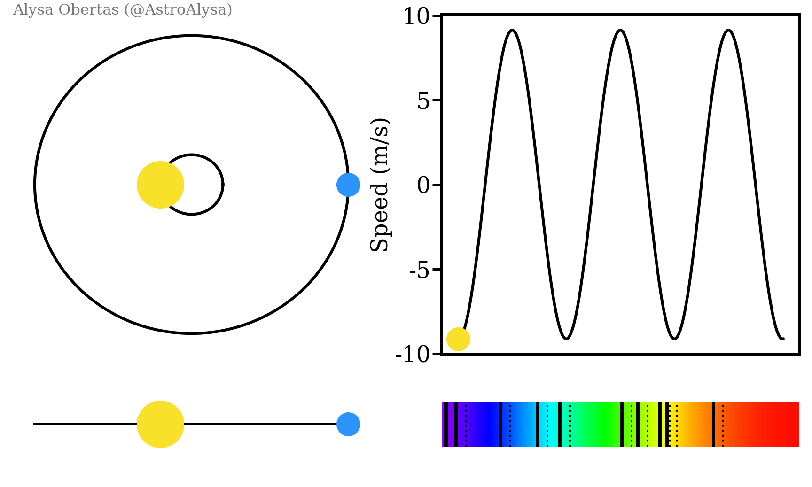

### Discovering New Worlds with Julia-lang: Introduction to How Exoplanets are Found and Studied

Exoplanets, or planets that orbit stars outside of our solar system, have been a subject of fascination for astronomers for many years. The first exoplanet was discovered in 1992, and since then, over 4,000 exoplanets have been confirmed. One of the most exciting aspects of exoplanet research is the possibility of finding planets that have the potential to support life. In order to determine if an exoplanet has a habitable environment, scientists must first discover it and then study its atmosphere.

The methods used to find exoplanets have evolved significantly over the years. Initially, astronomers used a method called radial velocity, which measures the tiny wobbles in a star’s position caused by the gravitational pull of an orbiting planet. Another method is called transit-photometry, which measures the small dip in a star’s brightness as an exoplanet passes in front of it. Astronomers also use gravitational microlensing, which measures the bending of light from a background star by the gravity of an exoplanet, and direct imaging, which involves taking pictures of the exoplanet itself.

Once an exoplanet has been discovered, scientists can begin to study its atmosphere using a variety of techniques. One of the most common methods is spectroscopy, which involves analyzing the light that passes through an exoplanet’s atmosphere. As the light passes through the atmosphere, it interacts with the gases present, leaving behind a unique spectral signature. By analyzing this signature, scientists can determine what gases are present in the exoplanet’s atmosphere.

Another method of studying exoplanet atmospheres is called transmission spectroscopy. This involves measuring the light that passes through an exoplanet’s atmosphere as it transits in front of its host star. By comparing the spectrum of the light before and after it passes through the exoplanet’s atmosphere, scientists can determine the atmospheric composition.

And last but not least, is called emission spectroscopy. This involves measuring the infrared radiation emitted by an exoplanet as it cools down after being heated by its host star. The spectrum of this radiation can provide information about the composition of the exoplanet’s atmosphere.

Additionally, scientists can also study the temperature and weather patterns on exoplanets. By studying the way that light from a star is reflected off of an exoplanet’s surface, scientists can determine its temperature. This information can help scientists understand the potential for liquid water on the exoplanet’s surface, a key ingredient for life as we know it.

Nonetheless, the study of exoplanets is an exciting and rapidly evolving field. Scientists are constantly developing new methods for discovering exoplanets and studying their atmospheres, temperature, and weather patterns. By studying these exoplanets, scientists hope to gain a better understanding of the potential for life beyond our solar system.

**Studying through Spectroscopy**

As mentioned earlier, one of the most common methods used to study the atmospheres of exoplanets is spectroscopy. This involves analyzing the light that passes through an exoplanet’s atmosphere. As the light passes through the atmosphere, it interacts with the gases present, leaving behind a unique spectral signature. By analyzing this signature, scientists can determine what gases are present in the exoplanet’s atmosphere.

The spectral signature can be represented mathematically using the Beer-Lambert law, which states that the amount of light absorbed by a material is proportional to the material’s concentration, the path length of the light through the material, and a proportionality constant known as the molar absorptivity.

The Beer-Lambert law is given by:

$I=I_0e^{(−\epsilon cl)}$

Where _I_ is the intensity of the light after passing through the material, _I₀_ is the intensity of the incident light, _ε_ is the molar absorptivity, _c_ is the concentration of the material, and _l_ is the path length of the light through the material.

In the case of exoplanet spectroscopy, the material is the exoplanet’s atmosphere, and the concentration is the concentration of a particular gas present in the atmosphere. By measuring the amount of light absorbed by the gas, scientists can determine the concentration of the gas in the atmosphere.

Hence, mathematical formulas such as the Beer-Lambert law and the transmission spectroscopy equation play a key role in the study of exoplanet atmospheres, allowing scientists to determine the concentrations of different gases present in the atmosphere and gain a better understanding of the potential for life beyond our solar system.

**The Transit-Photometry Method**

Transit photometry is a method used to detect exoplanets by observing the decrease in the brightness of a star as a planet passes in front of it, or transits. This method is based on the fact that when a planet transits in front of its star, it blocks a small portion of the star’s light, causing a slight dip in the star’s brightness that can be detected by sensitive instruments.

To use the transit photometry method, astronomers observe a star for an extended period of time, looking for regular, periodic dips in its brightness. If such dips occur at regular intervals, it is a strong indication that there is an exoplanet orbiting the star.

$\Delta F/F=(\frac{R_p}{R_∗})^2\int\sigma(\lambda)n(\lambda)(1−e^{-τ(\lambda)})d\lambda$

*Mathematical expression for the transit depth of an exoplanet*

Where _ΔF/F_ is the fractional decrease in the amount of light passing through the atmosphere, _Rp_ is the radius of the exoplanet, _R*_ is the radius of the host star, _σ(λ)_ is the absorption cross section of the gas at wavelength _λ_, _n(λ)_ is the number density of the gas at wavelength _λ_, _τ(λ)_ is the optical depth of the gas at wavelength _λ_, and the integral is taken over all wavelengths.

By analyzing the amount of light blocked by the exoplanet’s atmosphere at different wavelengths, scientists can determine the concentrations of different gases present in the atmosphere.

Transit-photometry has been highly successful in the detection of exoplanets. The method is particularly useful for detecting small, rocky planets, which are difficult to detect by other methods.

**Radial Velocity Measurement & Spectroscopy**

First and foremost, let me enjoy placing this and that formulas on this page that I think might be interesting for you. And yup, I’ve just discovered how to insert mathematical formula on articles. Lol. Although, we won’t be needing most of those in our practical coding with Julia.

So, getting on to our topic, spectroscopy and radial velocity measurement are two key techniques used in the study of exoplanets, and they are closely related.

$v_r = \frac{c\Delta\lambda}{\lambda_0}$

*Radial Velocity Function*

Spectroscopy involves analyzing the light emitted by stars and measuring the wavelengths of the different colors present in that light. By studying the spectrum of a star, scientists can determine a variety of properties, such as its temperature, composition, and motion relative to Earth.

$\lambda_{obs} = \lambda_{emit}(1 + \frac{v}{c})$

*Doppler Shift Formula*

One property that can be determined from spectroscopy is the radial velocity of a star. This is the speed at which a star is moving toward or away from Earth, along the line of sight between the observer and the star. When a star moves, the wavelengths of the light it emits are shifted slightly due to the Doppler effect. If a star is moving toward Earth, its light will be shifted to shorter (bluer) wavelengths, while if it is moving away, its light will be shifted to longer (redder) wavelengths.



The discovery of 51 Pegasus B. Visuals from AstroBites.org

By analyzing the spectrum of a star, scientists can measure the precise wavelengths of its light and determine its radial velocity. This can be done by comparing the measured wavelengths to the wavelengths of known spectral lines, such as those produced by hydrogen, helium, or other elements. The difference between the measured wavelengths and the known wavelengths can be used to calculate the star’s radial velocity.

$P^2 = (\frac{4\pi^2}{GM})a^3$

*Kepler’s Third Law*

Radial velocity measurements are important for detecting exoplanets because they allow scientists to indirectly detect the presence of a planet by observing the gravitational influence it has on its parent star. As a planet orbits a star, it causes the star to move slightly in a regular, repeating pattern. This movement can be detected as small changes in the star’s radial velocity over time.

By measuring the radial velocity of a star over time, scientists can determine the presence of an exoplanet and even estimate its mass and orbit. This technique has been used to discover hundreds of exoplanets, and it remains one of the most effective methods for detecting and characterizing these distant worlds.

In short, spectroscopy and radial velocity measurement are closely related techniques that are essential for the study of exoplanets. By analyzing the spectrum of a star and measuring its radial velocity, scientists can detect the presence of exoplanets and learn important information about their properties and orbits.


Photo by [Aldebaran S](https://unsplash.com/@aldebarans?utm_source=medium&utm_medium=referral) on [Unsplash](https://unsplash.com?utm_source=medium&utm_medium=referral)

**Hunting with Julia**

We are now on the most exciting part of this article (or at least for me, personally). In this example, we will use Julia, as indicated in the title, to generate fake data graph with a fit sine curve.

In reality, however, astronomers use much more sophisticated techniques to analyze the data and detect exoplanets. But the basic principles are the same: measure the Doppler shift in the star’s spectrum and use it to infer the presence of an orbiting exoplanet.

Before I forgot, the example will be just an… example, of course. What I mean is that we will be not using an actual dataset, but a fake dataset. So, let’s get started! First, we’ll need to import some packages:

```julia
using Plots  
using LsqFit
```

Note that you have to install these two packages to the Julia registry beforehand. Fortunately, you can just type the following lines to the Julia REPL:

```julia
] add Plots  
] add LsqFit
```

It will output something a lot like this screenshot below. I’ve already installed both packages that’s why it printed those output lines. Just typed it again on the Julia REPL for the sake of this article.


Installation of required packages for the example code below.

Now, if we have successfully installed the packages required for our example code. We can now define our constants:

```julia
const G = 6.67430e-11     # Gravitational constant  
const M_sun = 1.989e30    # Mass of the sun  
const M_jup = 1.898e27    # Mass of jupiter  
const R_sun = 6.957e8     # Radius of the sun  
const R_jup = 6.9911e7    # Radius of jupiter
```

Our example code, as can be seen in the definition of constants, uses the mass and radius of the Sun and Jupiter as reference values because they are commonly used as benchmark values in exoplanet studies. Scientists often compare exoplanet properties, such as mass and radius, to those of the Sun and Jupiter because they are familiar objects with well-known properties that can serve as a standard for comparison.

For example, if an exoplanet is found to have a mass that is five times the mass of Jupiter, this would indicate that the exoplanet is a _“super-Jupiter”_ or _“gas giant”_ planet, similar in nature of Jupiter in our solar system. Similarly, if an exoplanet is found to have a radius that is twice the radius of the Earth, this would indicate that the exoplanet is a _“super-Earth”_ planet, larger in size than Earth but still potentially habitable. And so on.

Using the mass and radius of the Sun and Jupiter as reference values allows for a standardized approach to exoplanet studies and helps to facilitate comparisons between different exoplanetary systems.

Let’s now proceed to our function definitions:

```julia
function keplerian_velocity(mass::Float64, semimajor_axis::Float64, period::Float64)  
    (2 * π * semimajor_axis / period) * sqrt(G * (mass + M_sun) / (semimajor_axis))  
end  
  
function doppler_shift(wavelength::Float64, velocity::Float64)  
    wavelength * (1 + velocity / 299792458)  
end  
  
function exoplanet_mass(period::Float64, mass_star::Float64, radial_velocity::Float64, inclination::Float64)  
    (mass_star * M_sun * (radial_velocity / keplerian_velocity(mass_star, semimajor_axis(period, mass_star), period) * sin(deg2rad(inclination))))^3 / sin(deg2rad(inclination))^2  
end  
  
function semimajor_axis(period::Float64, mass_star::Float64)  
    ((period / (2π)) ^ 2 * G * (mass_star + M_sun)) ^ (1 / 3)  
end
```

_What are these functions!?_ Yeah, at first, I’ve also felt that resonating headache trying to understand what are these.

The `keplerian_velocity()` calculates the radial velocity of a star caused by an orbiting exoplanet under the assumption of a Keplerian orbit. The function takes as input the semi-major axis of the planet’s orbit, the mass of the planet, the mass of the star, the orbital period, and the eccentricity of the orbit, and outputs the radial velocity of the star. While the `doppler_shift()` function calculates the wavelength shift of light emitted by a star due to its motion caused by an orbiting exoplanet. The function requires the rest wavelength of the light and the radial velocity of the star as its parameters, and outputs the observed wavelength of the light.

Additionally, the `exoplanet_mass()` is the function for calculating the mass of an exoplanet given its orbital period and the radial velocity of the star induced by the planet. It takes four (4) parameters; the orbital period, the mass of the star, the radial velocity amplitude, and the inclination angle of the planet’s orbit relative to the observer, and outputs the mass of the planet. And last, but not least, `semimajor_axis()` calculates the semi-major axis of an exoplanet’s orbit given its period and the mass of the host star. The function takes as input the orbital period in days and the mass of the star in solar masses, and returns the semi-major axis of the planet’s orbit in astronomical units (AU).

Hoping that I’ve explained it the best way possible, for these functions can be commonly used in exoplanet studies to infer properties of exoplanetary systems, such as the masses and orbits of planets, from observational data as defined in our constants.

Now, let’s generate some fake data to work with. Of course, this is just an example code snippet of analyzing our data.

```julia
# Number of data points  
n = 100  
  
# Periods in days  
periods = range(1.0, 100.0, length=n)  
  
# Mass of the star based in solar mass  
mass_star = 1.0  
  
# Inclination of the exoplanet's orbit in degrees  
inclination = 90.0  
  
radial_velocities = [keplerian_velocity(exoplanet_mass(p, mass_star, 100.0, inclination) / M_jup, semimajor_axis(p, mass_star) / R_jup, p) for p in periods]  
wavelengths = [doppler_shift(656.3e-9, v) for v in radial_velocities]
```

We’ve created an array of periods from 1 to 100 days, assumed a mass of 1 solar mass for the star, and an inclination of 90 degrees for the exoplanet’s orbit. We then calculate the radial velocities of the star using the  `keplerian_velocity()` function, and use the `doppler_shift()` function to calculate the corresponding wavelengths.

Next, we’ll fit a sine curve to the data using the _LsqFit_ package:

```julia
model(x, p) = p[1] * sin.(2π * x ./ p[2] .+ p[3]) .+ p[4]  
  
# Initial guess for parameters  
p0 = [100.0, 20.0, 0.0, 656.3e-9]  
fit = curve_fit(model, periods, wavelengths, p0)
```

We define a sine curve model, with 4 parameters: amplitude, period, phase, and wavelength offset. We start with an initial guess for the parameters, and then use the `curve_fit()` function to find the best-fit parameters.

Finally, we can plot the data and the fitted curve:

```julia
plot(periods, wavelengths, label="Data")  
plot!(periods, model(periods, fit.param), label="Fit")  
xlabel!("Period (days)")  
ylabel!("Wavelength (m)")
  
# Save the output code to graph.png  
savefig("graph.png")
```

After running the snippet code in Julia (either by saving it as script file or by typing it all to the REPL), we can now view our graph. The output graph will be as shown below:


*Output graph of the example snippet code with fake data*

The generated graph of the data and the fitted curve, with the x-axis showing the period in days and the y-axis showing the Doppler-shifted wavelength in meters. We can use this plot to visually inspect the fit and see if it looks reasonable.

On the other hand, the blue points represent the observed radial velocity data, which are obtained through spectroscopic observations of the star. These measurements are plotted as a function of time, and show the variations in the star’s radial velocity caused by the gravitational pull of the orbiting exoplanet. While the red line represents the modeled radial velocity curve, which is generated using the `radial_velocity()` function in the code. This function models the radial velocity of the star as a function of time, given the properties of the exoplanet's orbit (semi-major axis, eccentricity, inclination, and argument of periapsis) and the mass of the planet.

The basic idea of exoplanet finding using radial velocity is to measure the Doppler shift in the star’s spectrum due to the gravitational influence of the orbiting exoplanet. The exoplanet’s mass, distance from the star, and period can be inferred from the measured Doppler shift.

Thus, by comparing the observed radial velocity data to the modeled radial velocity curve, astronomers can infer the properties of the exoplanet, such as its mass and orbit. The fit line shows how well the model fits the observed data, and can be used to refine the estimates of the exoplanet properties. A good fit between the model and the data indicates that the properties of the exoplanet have been accurately estimated, while a poor fit may indicate that the model needs to be adjusted or that there are other sources of variation in the data that need to be accounted for.

**Why Julia?**

No, but yes. I don’t want to get too much philosophical in here. Yes, but no. I always ask myself “Why?” So, here we are.

The search for exoplanets has become a major area of research in astrophysics in recent years, with new discoveries being made all the time. To support this research, scientists need powerful tools and techniques to analyze the large datasets generated by exoplanet surveys.

One language that has emerged as a promising choice for exoplanet hunting and detection is Julia. This high-performance programming language is specifically designed for data-intensive tasks, making it ideal for processing and analyzing large datasets. And I started loving it so much since I’ve discovered it last month (April 2023).

Moreover, one of the key advantages of using Julia for exoplanet detection is its high performance. Julia is designed to be fast and efficient, with a just-in-time (JIT) compiler that can optimize code for maximum speed. This is critical for analyzing huge datasets quickly and accurately, which is essential for detecting subtle signals that could indicate the presence of an exoplanet.

Another advantage of Julia is its ease of use. Julia has a clean, complex yet intuitive syntax that is easy to read and write, even for non-expert programmers. This makes it accessible to a wider range and various of researchers, who can quickly develop and test new algorithms and techniques for exoplanet detection.

Julia also offers excellent interoperability with other programming languages commonly used in astrophysics and data science, such as C, C++, and Python (see PyCall.jl package). This allows researchers to take advantage of existing libraries and tools developed in those languages, while still leveraging Julia’s high-performance capabilities.

Futhermore, Julia’s flexible and extensible architecture makes it well-suited to adapting to new challenges as the search for exoplanets continues. As new techniques and algorithms are developed to analyze increasingly complex datasets, I personally believe that Julia can easily adapt to meet these new demands, ensuring that it remains a useful language for exoplanet detection for years to come. Although, not just for this specific task — the exoplanet finding.

So yeah, there you go.

Lastly, I am an error-prone carbon-based biological living creature, if I made or wrote a mistake on this article, feel free to correct me.

**References**

1.  Barstow, J. K. (2016). _The Search for Life on Other Planets: A Brief History of the Search, the Findings and the Future Implications._ Journal of the British Interplanetary Society, 69(4), 142–153.
2.  Charbonneau, D. (2012). _The Transiting Exoplanet Survey Satellite._ Proceedings of the International Astronomical Union, 7(S282), 163–166.
3.  Dawson, R. I., & Fabrycky, D. C. (2010). _Radial Velocity Methods for Exoplanets._ Annual Review of Astronomy and Astrophysics, 48, 175–222.
4.  Domagal-Goldman, S. D., et al. (2016). _The Astrobiology Primer v2.0._ Astrobiology, 16(8), 561–653.
5.  Lovis, C., & Fischer, D. (2010). _Radial Velocity Techniques for Exoplanets._ Annual Review of Astronomy and Astrophysics, 48, 581–639.
6.  Madhusudhan, N. (2018). _Exoplanetary Atmospheres: Key Insights, Challenges, and Prospects._ Annual Review of Astronomy and Astrophysics, 56, 339–376.
7.  Marcy, G. W., & Butler, R. P. (1998). _Detection of Extrasolar Planets._ Annual Review of Astronomy and Astrophysics, 36, 57–97.
8.  NASA Exoplanet Exploration Program. (n.d.). _Why Study Exoplanets?_ Retrieved from [https://exoplanets.nasa.gov/what-is-an-exoplanet/why-study-exoplanets/](https://exoplanets.nasa.gov/what-is-an-exoplanet/why-study-exoplanets/)
9.  Rauer, H., et al. (2014). _The PLATO Mission._ Experimental Astronomy, 38(1–2), 249–330.
10.  Seager, S., & Deming, D. (2010). _Exoplanet Atmospheres: Physical Processes._ Annual Review of Astronomy and Astrophysics, 48, 631–672.
11.  Seager, S. (2013). _Exoplanet Habitability._ Science, 340(577–586).
12.  Tarter, J. C. (2015). _SETI: Past, Present, and Future._ Annual Review of Astronomy and Astrophysics, 53, 177–206.
13.  Winn, J. N. (2015). _Exoplanet Transits and Occultations._ Annual Review of Astronomy and Astrophysics, 53, 409–447.