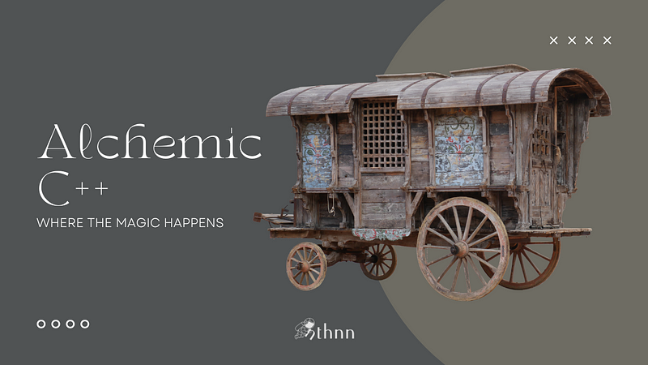
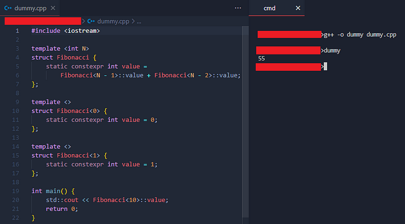
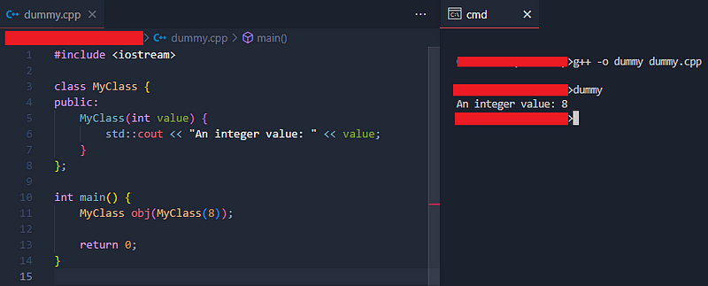
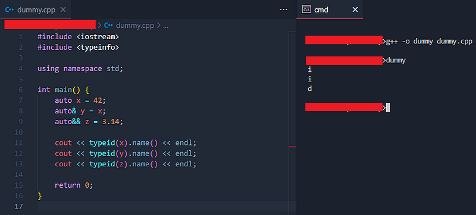
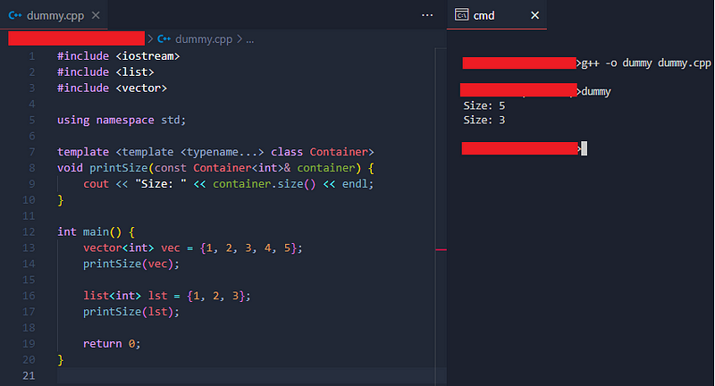
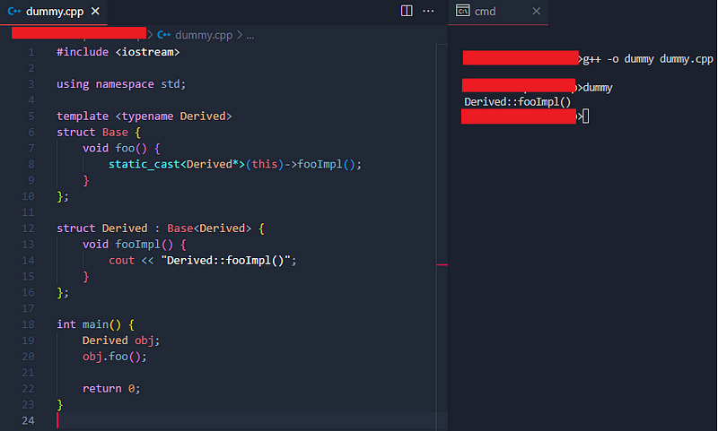
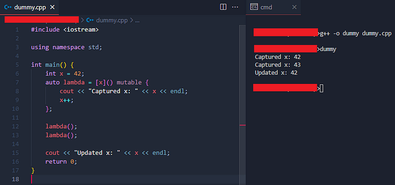
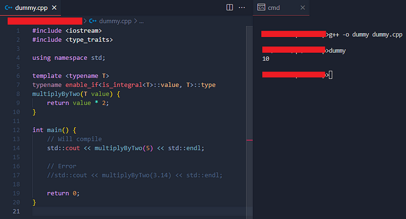
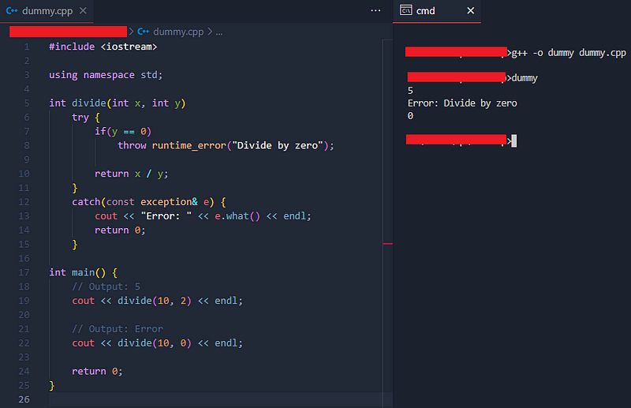
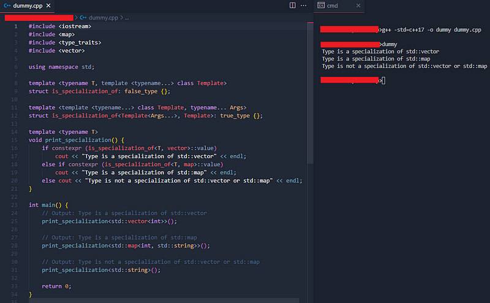

----------



### Alchemic C++: Where the Magic Happens

In the vast world of programming, few languages possess the versatility and power that C++ offers. As a language known for its efficiency, performance, and wide range of applications, C++ has become a staple for developers seeking to build robust and scalable software solutions. While beginners often dive into the fundamentals of C++ programming, there exists a realm of advanced techniques and code snippets that can elevate one’s skills to new heights.

In this article, I want to embark on an exploration of the depths of C++, delving into advanced-level code snippets that push the boundaries of what can be achieved with this remarkable language. Whether you’re a seasoned C++ programmer seeking to expand your knowledge or an ambitious learner eager to master the intricacies of the language, I have carefully curated, based on my experience, a collection of code snippets that I hope will challenge and inspire you.

Our journey will take us beyond the realm of basic syntax and common programming constructs, unraveling the mysteries of C++ to uncover its true potential. Brace yourself for an immersive experience as we unravel the complexities of C++ and uncover the secrets that lie beneath its surface.

**Why C++?**

C++ is a language that holds a special place in the programming world for several reasons. Here are a few key reasons why C++ is often chosen by developers for advanced-level programming:

1.  _Performance and Efficiency_: C++ is known for its high performance and efficiency, making it an ideal choice for applications that require speedy execution and optimal resource utilization. With its ability to directly access memory and hardware resources, C++ allows developers to fine-tune their code to achieve maximum performance.
2.  _Low-Level Control_: C++ provides low-level control over hardware resources, allowing developers to manage memory, manipulate pointers, and control hardware directly. This level of control is particularly valuable in scenarios where fine-grained control over system resources is required, such as embedded systems, game development, and high-performance computing.
3.  _Object-Oriented Programming (OOP)_: C++ is an object-oriented programming language, which means it supports the creation and manipulation of objects, encapsulation of data and functionality, inheritance, and polymorphism. OOP enables developers to write modular, reusable, and maintainable code, making it easier to manage large-scale projects.
4.  _Standard Template Library (STL)_: C++ comes with a rich Standard Template Library (STL), which provides a collection of powerful data structures (such as vectors, lists, and maps) and algorithms. The STL allows developers to leverage pre-built components, saving time and effort in implementing common data manipulation and algorithmic tasks.
5.  _Compatibility and Portability_: C++ is highly compatible with other programming languages and systems. It can be seamlessly integrated with existing codebases and libraries written in C, allowing developers to leverage the vast ecosystem of C libraries. Additionally, C++ compilers are available for various platforms, making it highly portable across different operating systems.
6.  _Industry Adoption_: C++ has a long history of industry adoption and is widely used in various domains, including game development, systems programming, finance, scientific computing, and more. Its robustness, performance, and versatility have made it a go-to language for building complex and critical applications.
7.  _Why not?_: After years of experience in the field, I still kept on being a faithful C++ for not ceasing to amaze me. So, why not?

These reasons make C++ a popular choice for advanced-level programming, as it offers developers a powerful and flexible toolset to tackle challenging programming tasks. However, it’s important to note that the choice of programming language ultimately depends on the specific requirements and context of the project at hand.

**The Alchemy**

So, if you’re ready to embark on a voyage into the world of advanced C++ programming, let’s begin our expedition and unlock the full power of this remarkable language!

----------

**_Compile-time Fibonacci sequence calculation using template metaprogramming_**

```cpp
#include <iostream>  
  
template <int N>  
struct Fibonacci {  
    static constexpr int value =  
        Fibonacci<N - 1>::value + Fibonacci<N - 2>::value;  
};  
  
template <>  
struct Fibonacci<0> {  
    static constexpr int value = 0;  
};  
  
template <>  
struct Fibonacci<1> {  
    static constexpr int value = 1;  
};  
  
int main() {  
    std::cout << Fibonacci<10>::value;  
    return 0;  
}
```

This code implements a compile-time calculation of the Fibonacci sequence using template metaprogramming in C++. Let’s break it down step by step.

The code defines a template struct called `Fibonacci`, which calculates the Fibonacci sequence at compile time. It takes an integer parameter `N` as a template argument. Then, inside the `Fibonacci` struct, there is a static member variable `value`, which stores the calculated Fibonacci value for the given template argument `N`. The value is determined by recursively adding the two previous Fibonacci values: `Fibonacci<N - 1>::value` and `Fibonacci<N - 2>::value`.

The code then specializes the `Fibonacci` struct for two base cases: when `N` is 0 and when `N` is 1. In both cases, the `value` member is set to the respective Fibonacci values of 0 and 1.

Finally, the `main` function outputs the value of the 10th Fibonacci number by calling `Fibonacci<10>::value` and printing it using `std::cout`.



Example output that shows “55” as the calculated value of 10th Fibonacci number.

----------

**_Most Vexing Parse_**

A perplexing parsing challenge arises in the C++ programming language when it comes to resolving a counterintuitive form of syntactic ambiguity. In specific scenarios, the C++ grammar fails to differentiate between defining an object parameter and specifying a function’s type. In such cases, the compiler is obliged to interpret the line as a function type specification.

```cpp
#include <iostream>  
  
class MyClass {  
public:  
    MyClass(int value) {  
        std::cout << "An integer value: " << value;  
    }  
};  
  
int main() {  
    MyClass obj(MyClass(8));  
      
    return 0;  
}
```

The code defines a class called `MyClass`. Inside the class, there is a single public constructor that takes an integer parameter `value`. The constructor's purpose is to print a message to the console, indicating that it has been called and displaying the value provided.

Inside the `main` function, is a variable of type `MyClass` called `obj` is declared and initialized with an argument `MyClass(8)`. When initializing `obj`, the constructor of `MyClass` is invoked. It prints the message _"An integer value: 8"_ to the console.



Most Vexing Parse example output.

----------

**_Type Omission and_** `auto` **_Keyword Usage_**

```cpp
#include <iostream>  
#include <typeinfo>  
  
using namespace std;  
  
int main() {  
    auto x = 42;  
    auto& y = x;  
    auto&& z = 3.14;  
  
    cout << typeid(x).name() << endl;  
    cout << typeid(y).name() << endl;  
    cout << typeid(z).name() << endl;  
  
    return 0;  
}
```

In this code, there are two additional concepts: references (`auto&`) and rvalue references (`auto&&`).

The line `auto& y = x;` declares `y` as a reference to `x`, and the type of `y` is deduced as `int&`, indicating that it's a reference to an integer. While the line `auto&& z = 3.14;` declares `z` as an rvalue reference to the initializer `3.14`, which is a floating-point literal. The type of `z` is deduced as `double&&`, representing an rvalue reference to a `double`.

We use the `typeid` operator and the `name()` member function from the `std::type_info` class to print the type names of `x`, `y`, and `z`.

At runtime, the program outputs:



Output of the example that shows both type omission and usage of the auto keyword.

----------

**_Template-template parameters and variadic templates_**

```cpp
#include <iostream>  
#include <list>  
#include <vector>  
  
using namespace std;  
  
template <template <typename...> class Container>  
void printSize(const Container<int>& container) {  
    cout << "Size: " << container.size() << endl;  
}  
  
int main() {  
    vector<int> vec = {1, 2, 3, 4, 5};  
    printSize(vec);  
  
    list<int> lst = {1, 2, 3};  
    printSize(lst);  
      
    return 0;  
}
```

The provided code demonstrates the usage of template-template parameters in C++ to create a function that prints the size of a container. First, we defined a function template `printSize()` that takes a container as its argument. The `Container` template-template parameter specifies that it accepts a template with one or more type parameters. The function is specialized for containers holding `int` elements.

Inside the function, we use the `container` argument and invoke the `size()` member function to obtain the size of the container. We then print the size using `cout`.

In the `main` function, we instantiate two containers: `vector<int> vec` and `list<int> lst`. We pass these containers as arguments to the `printSize()` function. Since both containers are specialized for `int`, the function can be called for each of them.



_Template-template parameters and variadic templates code example output._

----------

**_Curiously Recurring Template Pattern (CRTP) and Static Polymorphism_**

The _Curiously Recurring Template Pattern_ (CRTP) is an advanced C++ programming technique that involves using inheritance and templates to achieve static polymorphism. The CRTP allows a derived class to inherit from a base class while providing its own implementation of a certain behavior defined in the base class.

In the CRTP, a template class serves as the base class, and a derived class is created by inheriting from the template base class, with the derived class serving as the template argument. This creates a form of compile-time polymorphism where the behavior of the derived class is determined by the template argument.

```cpp
#include <iostream>  
  
using namespace std;  
  
template <typename Derived>  
struct Base {  
    void foo() {  
        static_cast<Derived*>(this)->fooImpl();  
    }  
};  
  
struct Derived : Base<Derived> {  
    void fooImpl() {  
        cout << "Derived::fooImpl()";  
    }  
};  
  
int main() {  
    Derived obj;  
    obj.foo();  
  
    return 0;  
}
```

The code defines a template struct called `Base`. This struct takes a template parameter `Derived`, which is expected to be a derived class inheriting from `Base<Derived>`. The `Base` struct provides a member function called `foo()`. Additionally, inside the `foo()` function, there is a `static_cast` that casts the `this` pointer to a pointer of type `Derived*`. This cast allows the derived class to access its own specific implementation of the `fooImpl()` function.

The code then defines a struct called `Derived`, which derives from `Base<Derived>`. It overrides the `fooImpl()` function with its own implementation.

Now, inside the `main()` function, the `foo()` function is invoked on the `obj` object. Since `Derived` inherits from `Base<Derived>`, the `foo()` function from the base class is called. However, due to the use of the CRTP, the call to `foo()` inside `Base` is resolved to `Derived::fooImpl()`.



Curiously Recurring Template Pattern (CRTP) example code output.

Furthermore, _Curiously Recurring Template Pattern_ (CRTP) can be used to implement an _Abstract Syntax Tree_ (AST) in C++. The CRTP can provide a mechanism for defining common behavior and structure in the base class, while allowing derived classes to provide specific implementations for different node types in the AST.

The importance of CRTP stems from the following benefits it offers:

1.  _Static polymorphism_: CRTP allows for static polymorphism, which means that the behavior of the derived class is determined at compile-time rather than runtime. This results in efficient code execution since virtual function dispatch and runtime polymorphism overhead are eliminated.
2.  _Code reuse and extension_: CRTP enables code reuse by providing a mechanism to add functionality to a base class without modifying it. The derived class can specialize or override specific behaviors of the base class by defining its own functions or variables. This promotes modular and maintainable code by separating concerns.
3.  _Performance optimizations_: By leveraging compile-time dispatch, CRTP can lead to performance optimizations. Since the function calls are resolved at compile-time, the overhead associated with virtual function dispatch is avoided, resulting in faster execution.
4.  _Type checking and compile-time errors_: CRTP allows for type checking at compile-time, ensuring that the derived class adheres to the interface defined by the base class. Any violations or errors are caught at compile-time, preventing runtime errors.
5.  _Implementation of static interfaces_: CRTP can be used to implement static interfaces, where the derived class provides a set of static functions or variables that can be accessed without instantiation. This can be useful for utility classes or for enforcing certain behaviors across a group of classes.

----------

**_Lambda expressions with capture_**

```cpp
#include <iostream>  
  
using namespace std;  
  
int main() {  
    int x = 42;  
    auto lambda = [x]() mutable {  
        cout << "Captured x: " << x << endl;  
        x++;  
    };  
      
    lambda();  
    lambda();  
      
    cout << "Updated x: " << x << endl;  
    return 0;  
}
```

The code above demonstrates the usage of a lambda function to capture and modify a variable. The lambda captures the variable `x` by value and can modify its copy inside the lambda function. However, the modifications made to the captured variable do not affect the original variable outside the lambda function.



_Lambda expressions with capture output example._

The `main` function is the entry point of the program. Inside it, an integer variable `x` is declared and initialized with the value 42. A lambda function is defined and assigned to the variable `lambda`. The lambda function captures the variable `x` by value (`[x]`) and is marked as mutable (`mutable`). This allows the lambda function to modify the captured variable.

Inside the lambda function, there is an output statement that prints the message _“Captured x: “_ followed by the value of `x` using `cout`. Then, the value of `x` is incremented (`x++`). The lambda function is invoked by calling `lambda()`.

The first output statement prints _“Captured x: 42”_ because the lambda function captures `x` by value at the time of its creation. The lambda function is invoked again by calling `lambda()`. While, the second output statement prints _“Captured x: 43”_ because the lambda function modifies the captured variable `x` by incrementing it.

Outside the lambda function, there is another output statement that prints the message _“Updated x: “_ followed by the value of `x` using `cout`. It outputs the original value of `x` (42) because the lambda function's modifications do not affect the original variable `x` since it was captured by value.

----------

**_Substitution Failure Is Not An Error (SFINAE)_**

_Substitution Failure Is Not An Error_ (SFINAE) is a principle in C++ template metaprogramming. It refers to the behavior of the compiler when attempting to substitute template arguments during the process of template specialization.

In C++, templates are a powerful mechanism that allows generic programming. When using templates, the compiler tries to match the provided template arguments with the template parameters to determine the appropriate specialization to use. However, if the substitution of template arguments fails during this process, the compiler does not consider it an error. Instead, it tries other available specializations or generates a compilation error only if no suitable specialization is found.

The concept of SFINAE is often used in combination with template function overloading and type traits. It allows template code to selectively enable or disable certain template specializations based on the properties or capabilities of the provided template arguments. By leveraging SFINAE, developers can create more flexible and generic code that adapts to different types or conditions.

The SFINAE principle can be quite complex, involving intricate rules and techniques such as the use of `std::enable_if`, `decltype`, `std::void_t`, and more. It is a fundamental aspect of C++ template metaprogramming and is used extensively in libraries and frameworks to achieve compile-time polymorphism and type-based dispatching.

```cpp
#include <iostream>  
#include <type_traits>  
  
using namespace std;  
  
template <typename T>  
typename enable_if<is_integral<T>::value, T>::type  
multiplyByTwo(T value) {  
    return value * 2;  
}  
  
int main() {  
    // Will compile  
    std::cout << multiplyByTwo(5) << std::endl;  
  
    // Error  
    //std::cout << multiplyByTwo(3.14) << std::endl;  
      
    return 0;  
}
```

The code defines a function template called `multiplyByTwo`, which takes a single template parameter `T`. It returns `T` and uses the `enable_if` and `is_integral` type traits to conditionally enable the function for integral types only.

Inside the function template, `enable_if` is used to enable the function if `is_integral<T>::value` evaluates to `true`. The `typename` keyword is used to specify the dependent type. The `is_integral` type trait checks whether the type `T` is an integral type (e.g., `int`, `long`, etc.). It provides a static member variable `value` that is `true` if `T` is an integral type, and `false` otherwise.

If the `enable_if` condition is satisfied (i.e., `T` is an integral type), the function multiplies the `value` parameter by 2 and returns the result.

Inside the `main()` function, the `multiplyByTwo` function is called with an argument of type `5`, which is an integer literal. The first `cout` statement outputs the result of calling `multiplyByTwo(5)`, which is `10`, to the console. And the second `cout` statement is commented out intentionally to demonstrate that calling `multiplyByTwo()` with a non-integral argument (e.g., `3.14`) would result in a compilation error.



Substitution Failure Is Not An Error (SFINAE) example code output.

The importance of SFINAE lies in its ability to enable more flexible and generic code through template specialization and overloading. By allowing the compiler to automatically choose the best match from a set of overloaded template functions, SFINAE enables the creation of code that can handle different types or combinations of arguments in a generic way.

1.  _Improved code flexibility_: SFINAE allows you to write generic code that can handle a variety of types and conditions. It enables template functions to be instantiated with different argument types and perform different behaviors based on the available substitutions.
2.  _Compile-time type checking_: SFINAE provides a mechanism for performing compile-time type checking. It allows you to selectively enable or disable template functions based on the presence or absence of certain member functions or types in the arguments.
3.  _Error resilience_: SFINAE prevents template instantiations from being outright errors. Instead of causing a compilation failure, it allows the compiler to consider other template specializations or function overloads, leading to graceful degradation or alternative behavior.
4.  _Expression SFINAE_: With the introduction of C++11, expression SFINAE extends the concept of SFINAE by allowing the substitution to fail based on the validity of a specific expression involving the template arguments. This enables more fine-grained control over template specialization and overload resolution.

----------

**_Function-level try blocks for exception handling_**

Actually, I, discovered this syntax by accident. I don’t have any idea how often this syntax is used, but I believe not many knows this since I haven’t seen any codes on GitHub with the try-catch handler on function-level.

```cpp
#include <iostream>  
  
using namespace std;  
  
int divide(int x, int y)  
    try {  
        if(y == 0)  
            throw runtime_error("Divide by zero");  
  
        return x / y;  
    }  
    catch(const exception& e) {  
        cout << "Error: " << e.what() << endl;  
        return 0;  
    }  
  
int main() {  
    // Output: 5  
    cout << divide(10, 2) << endl;  
  
    // Output: Error  
    cout << divide(10, 0) << endl;  
  
    return 0;  
}
```

The code defines a function called `divide` that takes two integer parameters, `x` and `y`. It uses a `try` block to encapsulate the code that may throw an exception. While inside the `try` block, the code checks if `y` is zero. If it is, an exception of type `runtime_error` is thrown with the message _“Divide by zero”_.

If `y` is not zero, the code returns the result of dividing `x` by `y` (`x / y`). If an exception is thrown inside the `try` block, the control flow is transferred to the corresponding `catch` block.

The `catch` block catches exceptions of type `const exception&` (which can include exceptions derived from `std::exception`). Inside the `catch` block, the caught exception is accessed through the `e` parameter. The code then outputs the message “_Error: ”_followed by the exception message obtained by calling `e.what()`. After handling the exception in the `catch` block, the code returns 0 as the result.

Now, the `divide` function is called twice with different arguments inside the `main()` function. The first `cout` statement outputs the result of calling `divide(10, 2)`, which is 5, to the console. The second `cout` statement outputs the result of calling `divide(10, 0)`, which throws an exception, to the console. The exception is caught in the `catch` block, and the corresponding error message is displayed.



_Function-level try blocks for exception handling example code output._

----------

**_Variadic template to check if a type is a specialization of a template_**

Basically, the code below demonstrates a way to check if a given type is a specialization of a specific template class in C++.

```cpp
#include <iostream>  
#include <map>  
#include <type_traits>  
#include <vector>  
  
using namespace std;  
  
template <typename T, template <typename...> class Template>  
struct is_specialization_of: false_type {};  
  
template <template <typename...> class Template, typename... Args>  
struct is_specialization_of<Template<Args...>, Template>: true_type {};  
  
template <typename T>  
void print_specialization() {  
    if constexpr (is_specialization_of<T, vector>::value)  
        cout << "Type is a specialization of std::vector" << endl;  
    else if constexpr (is_specialization_of<T, map>::value)  
        cout << "Type is a specialization of std::map" << endl;  
    else cout << "Type is not a specialization of std::vector or std::map" << endl;  
}  
  
int main() {  
    // Output: Type is a specialization of std::vector  
    print_specialization<std::vector<int>>();  
  
    // Output: Type is a specialization of std::map  
    print_specialization<std::map<int, std::string>>();  
  
    // Output: Type is not a specialization of std::vector or std::map  
    print_specialization<std::string>();  
      
    return 0;  
}
```

As can be seen above, the code defines a type trait called `is_specialization_of` as a struct. It is used to check if a type `T` is a specialization of a template class `Template`. The primary template of `is_specialization_of` is defined with a specialization tag set to `false_type`.

Moreover, the partial specialization of `is_specialization_of` is defined for the case when `T` matches the pattern `Template<Args...>`. In this case, the specialization tag is set to `true_type`.

Meanwhile, the `print_specialization` function template takes a single template parameter `T` and is used to print whether `T` is a specialization of `vector`, `map`, or neither.

Inside `print_specialization`, the `if constexpr` statement is used to perform compile-time conditional branching. If `T` is a specialization of `std::vector`, the code prints the message _“Type is a specialization of std::vector.”_ If `T` is a specialization of `std::map`, the code prints the message _“Type is a specialization of std::map.”_ Otherwise, if neither condition is met, the code prints the message _“Type is not a specialization of std::vector or std::map.”_

The `print_specialization` function is called three times with different types as template arguments. The first `print_specialization` call with `std::vector<int>` as the template argument prints the message _“Type is a specialization of std::vector.”_ While, the second `print_specialization` call with `std::map<int, string>` as the template argument prints the message _“Type is a specialization of std::map.”_ And finally, the third `print_specialization` call with `string` as the template argument prints the message _“Type is not a specialization of std::vector or std::map.”_



Variadic template to check if a type is a specialization of a template example code output.

----------

There, we have it! The alchemic syntaxes for C++ that can make the magic happen!

**Now what?**

To summarize this comprehensive article on advanced-level C++ code snippets, we have explored a range of topics that push the boundaries of C++ programming. Starting from compile-time calculations using template metaprogramming to intricate language features like the _Most Vexing Parse_ and type omission with the `auto` keyword, we have delved into the depths of C++ to uncover its true power. Additionally, we have examined advanced techniques such as template-template parameters, variadic templates, the _Curiously Recurring Template Pattern_ (CRTP), and static polymorphism. We have also explored lambda expressions with capture, the _Substitution Failure Is Not An Error_ (SFINAE) principle, and function-level try blocks for exception handling. Furthermore, we have investigated how variadic templates can be utilized to check if a type is a specialization of a template.

Hence, C++ is a language that continues to astonish programmers with its depth and versatility. By delving into advanced-level code snippets, we have witnessed the true power of C++ and its ability to tackle complex programming challenges. From compile-time computations to intricate language constructs and template wizardry, the topics covered in this article have provided a glimpse into the immense potential that lies within C++. As we explored these advanced concepts, it became evident that mastering C++ requires continuous learning and experimentation. By incorporating these techniques into our programming arsenal, we gain the ability to craft more efficient, robust, and elegant solutions.

It’s also important to remember that this is merely the tip of the iceberg. The C++ language is vast and ever-evolving, offering endless opportunities for innovation and creativity. By immersing ourselves in the intricacies of C++, we not only expand our programming knowledge but also unlock new avenues for solving complex problems. Personally, I encourage you to continue your journey of exploration and discovery, experimenting with these advanced techniques and pushing the boundaries of what can be achieved with C++.

The world of C++ awaits, ready to reward those who dare to venture into its depths!

**For further readings and references:**

1.  Abrahams, D., & Gurtovoy, A. (2005). C++ Template Metaprogramming: Concepts, Tools, and Techniques from Boost and Beyond. Addison-Wesley Professional.
2.  Alexandrescu, A. (2001). Modern C++ Design: Generic Programming and Design Patterns Applied. Addison-Wesley Professional. (pg. 175–200).
3.  Boccara, J. (2020). Understanding the Most Vexing Parse in C++. Fluent C++. [Blog post]. Retrieved from [https://www.fluentcpp.com/2018/10/05/understanding-the-most-vexing-parse/](https://www.fluentcpp.com/2018/10/05/understanding-the-most-vexing-parse/)
4.  Schilling, K. (2015). Demystifying the C++ Lambda Capture List. Pluralsight. Retrieved from [https://www.pluralsight.com/guides/demystifying-the-c-lambda-capture-list](https://www.pluralsight.com/guides/demystifying-the-c-lambda-capture-list)
5.  Stoyenko, A. (2016). An Introduction to the Curiously Recurring Template Pattern (CRTP) in C++. Fluent C++. Retrieved from [https://www.fluentcpp.com/2017/05/12/curiously-recurring-template-pattern/](https://www.fluentcpp.com/2017/05/12/curiously-recurring-template-pattern/)
6.  Stroustrup, B. (2013). The C++ Programming Language (4th Edition). Addison-Wesley Professional. (pg. 47–59, 307–330, & 512–520).
7.  Sutter, H. (2005). Exceptional C++: 47 Engineering Puzzles, Programming Problems, and Solutions. Addison-Wesley Professional. (pg. 47–53).
8.  Vandevoorde, D., & Josuttis, N. M. (2017). C++ Templates: The Complete Guide (2nd Edition). Addison-Wesley Professional. (pg. 372–395, 474–497, & 549–572).